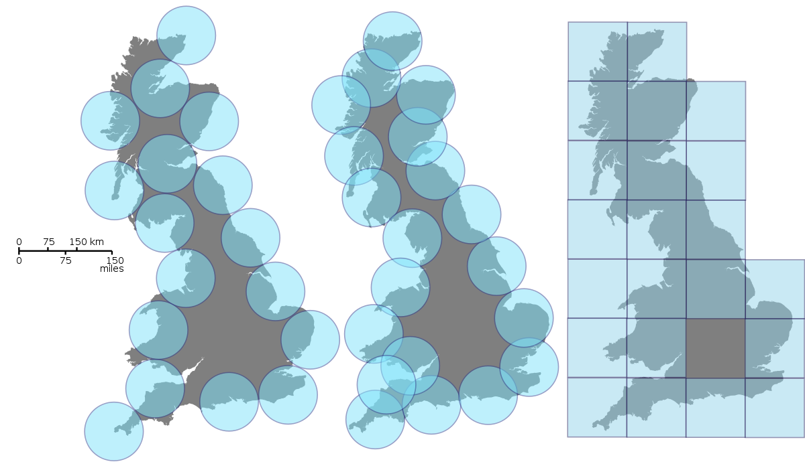
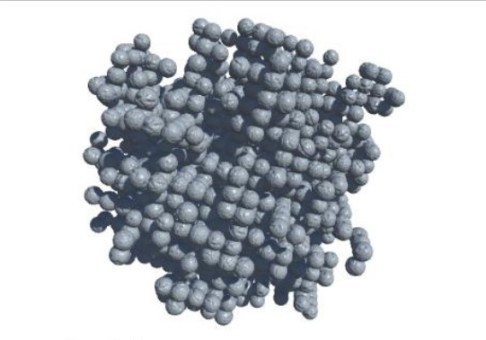
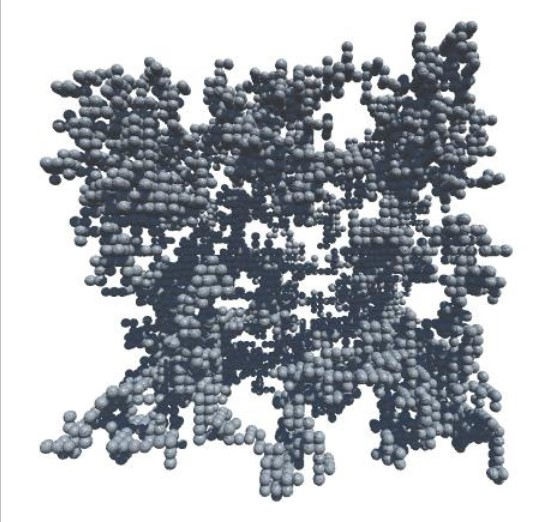

# Неравновесная агрегация, фракталы
## Ramzi Al-Dorikhim, Vasily O. Khuditsky, Nikita A. Toponen, Arsenij A. Ilinsky
## RUDN University, 22 February 2022 Moscow, Russia

--- 

# Неравновесная агрегация и фракталы

---

##### Агрегация, ограниченная диффузией

- Компьютерная модель агрегации, ограниченной диффузией представляет собой поле, заполненное частицами, совершающими хаотическое броуновское движение. На поле вносится центр агрегации, к которому «прилипает» всякая случайно прикоснувшаяся частица.

#### Рис.1 Фрактальный кластер из частиц льда

---

##### Фрактальная размерность

- Метод *сфер* или *ящиков* - для сферы можно вычислить массу части фигуры, оказавшейся внутри нее.
- Метод *подсчета клеток* - разбиение куба, охватывающего фигуру на более маленькие, и подсчет тех кубов, которые не пусты.

#### Рис.2 Методы измерения фрактальной размерности
---

##### Бессеточная модель

- Структура полученных DLA-кластеров отражает структуру сетки (имеются выделенные направления). Чтобы получить более симметричные кластеры, можно отказаться от сетки. В этом случае рост происходит следующим образом: вначале помещаем в центр поля затравочную частицу, затем с круга некоторого радиуса выпускаем следующую, которая случайно блуждает. Если частицы сближаются на расстояние взаимодействия (например, их удвоенный радиус), они слипаются. После этого выпускаем новую частицу и т. д.

---

##### Химически-ограниченная агрегация

- При диффузионно-ограниченной агрегации ( DLA ) частица всегда прилипает к кластеру с вероятностью 1. Можно уменьшить вероятность прилипания. Такой процесс роста называется химически-ограниченной агрегацией.
- Химическая-ограниченная агрегация моделирует ситуацию, когда вероятность зависит от того, каким концом молекула повернута к другой. Это приведет к появлению более плотных агрегатов (увеличению размерности), потому что у частицы увеличится шанс проникать во внутренние области и заполнять пустоты.

---

##### Баллистическая агрегация

- Модель баллистической агрегации описывает ситуации, когда агрегаты растут на поверхности, и частицы свободно падают по прямолинейным траекториям. Частица прилипает, когда оказывается рядом с занятым узлом. В этом процессе получается более плотный агрегат, однако его граница сильно изрезана и является фракталом.

#### Рис.3 Баллистическая агрегация

---

##### Кластер–кластерная агрегация

- В случае роста агрегатов из первоначально однородной системы следует ожидать одновременного возникновения нескольких кластеров и их роста за счет поглощения мелких частиц, а также слипания друг с другом. Такой рост описывается моделью кластер–кластерной агрегации. Коэффициент диффузии может зависеть от размера агрегата.

#### Рис.4 Кластер–кластерная агрегация

---

##### Библиография

1. Медведев Д. А., Куперштох А. Л., Прууэл Э. Р., Сатонкина Н. П., Карпов Д. И. : Моделирование физических процессов и явлений на ПК: Учеб. пособие / Новосибирск: Новосиб. гос. ун-т., 2010. — 101 с.
2. Электронный ресурс [Simulating 2D diffusion-limited aggregation (DLA) with JavaScript](https://medium.com/@jason.webb/) : https://medium.com/@jason.webb/simulating-dla-in-js-f1914eb04b1d
3. Международный научно-практический журнал "Программные продукты и системы": Тыртышников А.Ю., Лебедев И.В., Иванов С.И., Меньшутина Н.В. : [Сравнение алгоритмов DLA и RLA при моделировании пористых структур](http://swsys.ru/index.php?page=article&id=4380) Статья опубликована в выпуске журнала № 4 за 2017 год. [ на стр. 758-764 ] http://swsys.ru/index.php?page=article&id=4380
---

# Спасибо за внимание!
