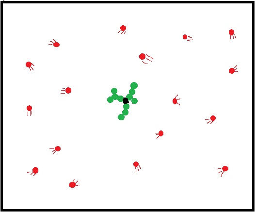
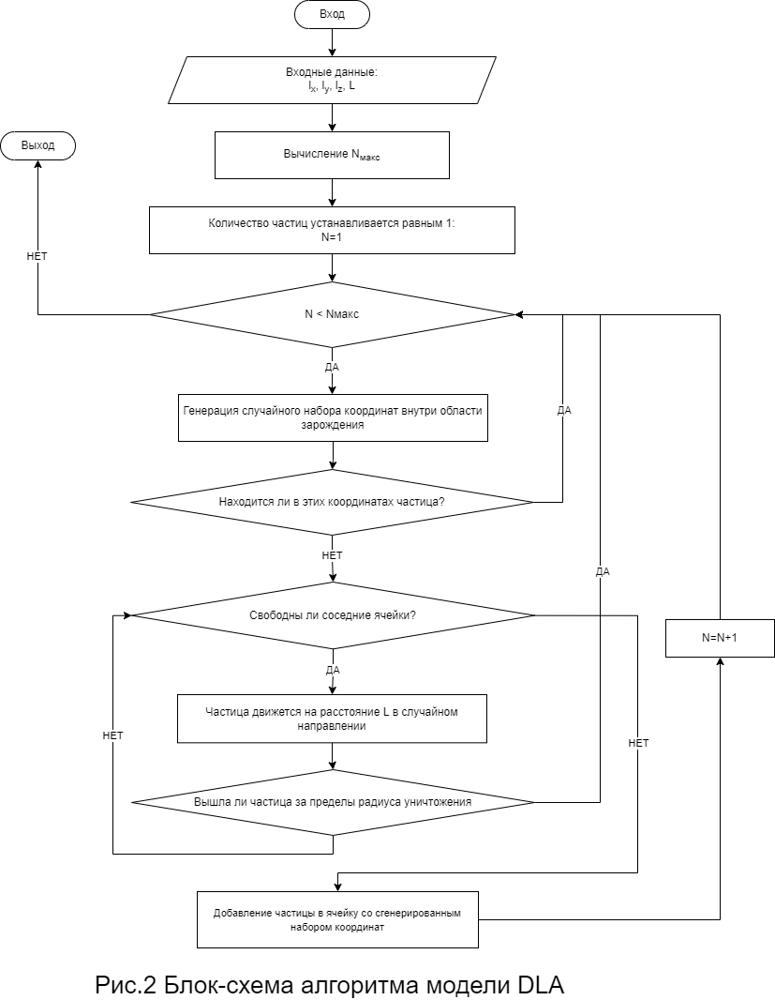

# Алгоритмы неравновесной агрегации
## Ramzi Al-Dorikhim, Vasily O. Khuditsky, Nikita A. Toponen, Arsenij A. Ilinsky
## RUDN University, 3 March 2022 Moscow, Russia

--- 

# Агрегация, ограниченная диффузией

---

### Простой пример DLA

- Один мяч в центре(черный)

- Запускаем по комнате мячи(красные)

- Образуется кустообразная структура

#### Рис.1 Простой пример DLA

---

---

### Химически-ограниченная агрегация

- Моделирует ситуацию, когда вероятность зависит от того, каким концом молекула повернута к другой.

- Приводит к появлению более плотных агрегатов.

- Размерность остается меньше размерности пространства, т. е. кластер остается фракталом.

---

### Баллистическая модель

- Частица, зародившись, двигается по прямой в случайно выбранном направлении до столкновения с частицей и последующей агрегации.

- Итоговая структура, получается более плотной, чем при использовании DLA.

---

### Кластер-кластерная модель

- Число частиц определено и все они помещены на поле.

- Все частицы движутся внутри поля, отскакивая, когда достигают его границ.

- При столкновении друг с другом частицы агрегируются в один кластер.

---

### Библиография

1. Медведев Д. А., Куперштох А. Л., Прууэл Э. Р., Сатонкина Н. П., Карпов Д. И. : Моделирование физических процессов и явлений на ПК: Учеб. пособие / Новосибирск: Новосиб. гос. ун-т., 2010. — 101 с.
2. Электронный ресурс [Simulating 2D diffusion-limited aggregation (DLA) with JavaScript](https://medium.com/@jason.webb/) : https://medium.com/@jason.webb/simulating-dla-in-js-f1914eb04b1d
3. Международный научно-практический журнал "Программные продукты и системы": Тыртышников А.Ю., Лебедев И.В., Иванов С.И., Меньшутина Н.В. : [Сравнение алгоритмов DLA и RLA при моделировании пористых структур](http://swsys.ru/index.php?page=article&id=4380) Статья опубликована в выпуске журнала № 4 за 2017 год. [ на стр. 758-764 ] http://swsys.ru/index.php?page=article&id=4380

---

4. Электронный ресурс [Симуляция роста кристаллов: ограниченная диффузией агрегация на Javascript](https://habr.com/ru/post/507444/) : https://habr.com/ru/post/507444/

5. Электронная энциклопедия Wikipedia. Статья: [Diffusion-limited aggregation](https://en.wikipedia.org/wiki/Diffusion-limited_aggregation) : https://en.wikipedia.org/wiki/Diffusion-limited_aggregation

---

# Спасибо за внимание!