---
# Front matter
lang: ru-RU
title: "Лабораторная работа №1"
subtitle: "Математическое моделирование"
author: "Аль-Дорихим Рамзи Авад"

# Formatting
toc-title: "Содержание"
toc: true # Table of contents
toc_depth: 2
lof: true # List of figures
lot: true # List of tables
fontsize: 12pt
linestretch: 1.5
papersize: a4paper
documentclass: scrreprt
polyglossia-lang: russian
polyglossia-otherlangs: english
mainfont: PT Serif
romanfont: PT Serif
sansfont: PT Sans
monofont: PT Mono
mainfontoptions: Ligatures=TeX
romanfontoptions: Ligatures=TeX
sansfontoptions: Ligatures=TeX,Scale=MatchLowercase
monofontoptions: Scale=MatchLowercase
indent: true
pdf-engine: lualatex
header-includes:
  - \usepackage[russian]{babel}
  - \linepenalty=10 # the penalty added to the badness of each line within a paragraph (no associated penalty node) Increasing the value makes tex try to have fewer lines in the paragraph.
  - \interlinepenalty=0 # value of the penalty (node) added after each line of a paragraph.
  - \hyphenpenalty=50 # the penalty for line breaking at an automatically inserted hyphen
  - \exhyphenpenalty=50 # the penalty for line breaking at an explicit hyphen
  - \binoppenalty=700 # the penalty for breaking a line at a binary operator
  - \relpenalty=500 # the penalty for breaking a line at a relation
  - \clubpenalty=150 # extra penalty for breaking after first line of a paragraph
  - \widowpenalty=150 # extra penalty for breaking before last line of a paragraph
  - \displaywidowpenalty=50 # extra penalty for breaking before last line before a display math
  - \brokenpenalty=100 # extra penalty for page breaking after a hyphenated line
  - \predisplaypenalty=10000 # penalty for breaking before a display
  - \postdisplaypenalty=0 # penalty for breaking after a display
  - \floatingpenalty = 20000 # penalty for splitting an insertion (can only be split footnote in standard LaTeX)
  - \raggedbottom # or \flushbottom
  - \usepackage{float} # keep figures where there are in the text
  - \floatplacement{figure}{H} # keep figures where there are in the text
---

# Цель лабораторной работы                                                                                                 

Изучить основные команды Git Bash, предназначенные для работы с git.

# План лабораторной работы

- 1.1 Подготовка

- 1.2 Создание проекта

- 1.3 Внесение изменений

- 1.4 Индексация изменений

- 1.5 Отмена локальных изменений (до индексации)

- 1.6 Отмена проиндексированных изменений (перед коммитом)

- 1.7 Отмена коммитов

- 1.8 Удаление коммиттов из ветки

- 1.9 Удаление тега oops

- 1.10 Внесение изменений в коммиты

- 1.11 Перемещение файлов

- 1.12 Второй способ перемещения файлов

- 1.13 Подробнее о структуре

- 1.14 Git внутри: Каталог .git

- 1.15 Работа непосредственно с объектами git

- 1.16 Создание ветки

- 1.17 Навигация по веткам

- 1.18 Изменения в ветке master

- 1.19 Сделать коммит изменений README.md в ветку master

- 1.20 Слияние

- 1.21 Создание конфликта

- 1.22 Разрешение конфликтов

- 1.23 Сброс ветки style

- 1.24 Сброс ветки master

- 1.25 Перебазирование

- 1.26 Слияние в ветку master

- 1.27 Клонирование репозиториев

- 1.28 Просмотр клонированного репозитория

- 1.29 Что такое origin?

- 1.30 Удаленные ветки

- 1.31 Изменение оригинального репозитория

- 1.32 Слияние извлеченных изменений

- 1.33 Добавление ветки наблюдения

- 1.34 Чистые репозитории

- 1.35 Создание чистого репозитория

- 1.36 Добавление удаленного репозитория

- 1.37 Отправка изменений

- 1.38 Извлечение общих изменений

# Выполнение лабораторной работы

## 1.1 Подготовка

**1.1.1 Установка имени и электронной почты**

Так как я никогда ранее не использовал git, для начала я осуществляю установку. 

Передаю git свое имя и электронную почту. (рис. 001)

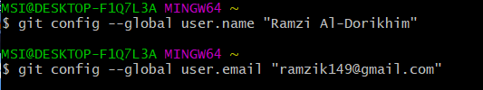

​			

**1.1.2 Параметры установки окончаний строк**

Далее нам нужно настроить core.autocrlf, что бы все переводы строк текстовых файлов в репозитории были одинаковы.

Производим настройку для Windows. (рис. 002)

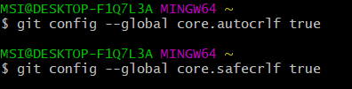

**1.1.3 Установка отображения unicode**

По умолчанию, git будет печатать не-ASCII символов в именах файлов в виде восьмеричных последовательностей \nnn.

Что бы избежать нечитаемые строки, установим соответствующий флаг. (рис. 003)

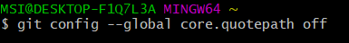

## 1.2 Создание проекта

**1.2.1 Создаем страницу "Hello, World"**

Создадим пустой каталог hello и создадим там файл с именем hello.html. (рис. 004)

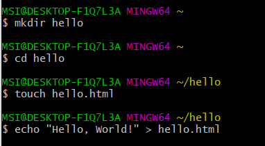

**1.2.2 Создание репозитория**

Выполним команду git init, что бы создать репозиторий из этого каталога. (рис. 005)

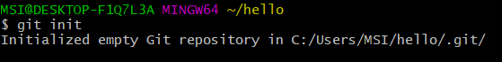

**1.2.3 Добавление файла  в репозиторий**

Добавление файла в репозиторий. (рис. 006)

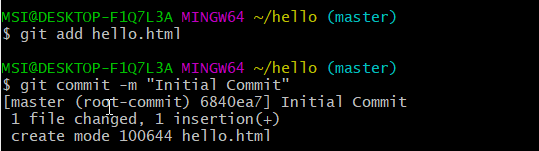

**1.2.4 Проверка состояния репозитория**

Используем команду git status, что бы проверить текущее состояние репозитория. (рис. 007)

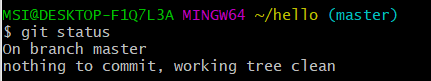

## 1.3 Внесение изменений

**1.3.1 Изменение страницы "Hello, World"**

Изменим содержимое файла hello.html, добавив HTML-теги. (рис. 008)

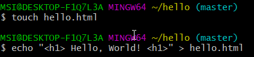

Проверим состояние рабочего каталога. (рис. 009)

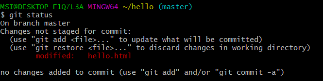

Git знает, что файл hello.html был изменен, но изменения еще не зафиксированы в репозитории.

## 1.4 Индексация изменений

Выполним команду git add <\file name> , что бы проиндексировать изменения. (рис. 010)

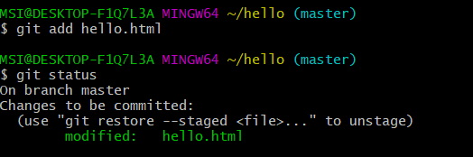

Изменения файла hello.html были проиндексированны. Git теперь знает об изменениях.

Правда изменение пока не записано в репозиторий.

**1.4.1 Коммит изменений**

Используем команду git commit, что бы сделать коммит изменений. Откроется редактор Vim, в котором я написал комментарий: "Added h1 tag". (рис. 011)

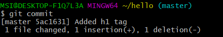

Проверим состояние каталога. (рис. 012)

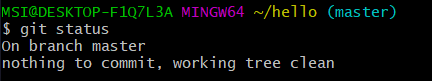

**1.4.2 Добавим стандартные теги страницы**

Изменим страницу "Hello, World", чтобы она содержала стандартные теги <\html> и <\body>. (рис. 013)

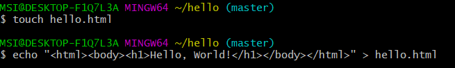 

Добавим это изменение в индекс git и далее добавим заголовки HTML. (рис. 014)

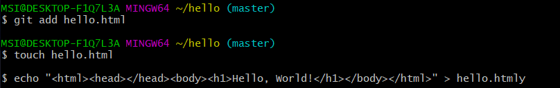

Проверим текущий статус. (рис. 015)

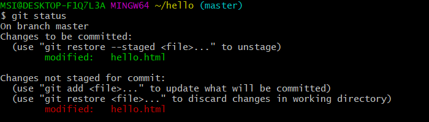

Обратим внимание на то, что hello.html указан дважды в состоянии.

Произведём коммит проиндексированного изменения и проверим состояние еще раз. (рис.  016)

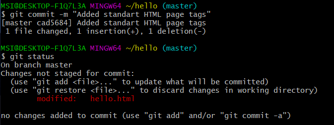

Состояние говорит нам, что hello.html имеет незафиксированные изменения.

Теперь добавим второе изменение в индекс и проверим состояние. (рис. 017)

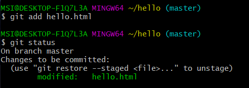

Второе изменение было проиндексировано и готово к коммиту.

Сделаем коммит второго изменения. (рис. 018)

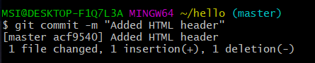

**1.4.3 История**

Получим список произведенных изменений. (рис. 019)

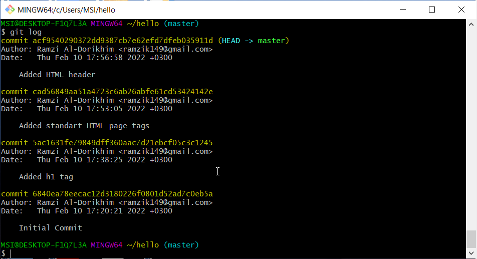

Однострочный формат истории. (рис. 020)

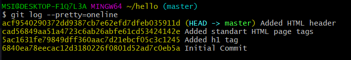

**1.4.4 Получение старых версий**

Возвращаться назад в историю очень просто. При помощи команды checkout мы может вернуться в любую точку.

Изучим хэши предыдущих версий , изображенных на рис. 020. Найдем хэш для первого коммита. Далее используем хэш-код 6840ea7 с командой checkout. (рис. 021)

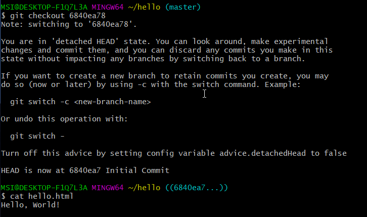

Так же на рисунке выше , мы проверили содержимое файла hello.html, после применения команды checkout. И мы видим первоначальное состояние нашего файла.

Далее вернемся к последней версии в ветке master. (рис. 022)

**1.4.5 Создание тегов версий**

Давайте назовем текущую версию страницы hello первой(v1). (рис. 023)

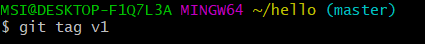

Теперь текущая версия страницы называется v1.

Давайте теперь создадим тег для версии, которая идет перед текущей версией и назовем его v1-beta. Для начала нам надо переключиться на предыдущую версию. Для этого используем команду git checkout v1^. Это должна быть версия с тегами <\html> и <\body> , но без <\head>. (рис. 024)

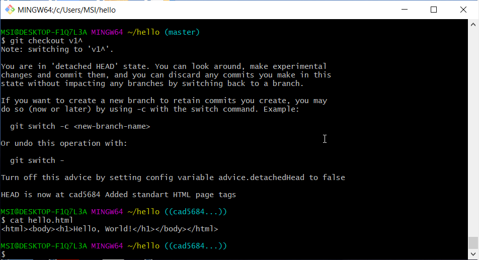

Создание тега. (рис. 025)

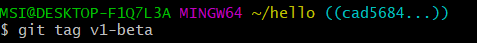

**1.4.6 Переключение по имени тега**

Теперь попробуем попереключаться  между двумя отмеченными версиями. (рис. 026)

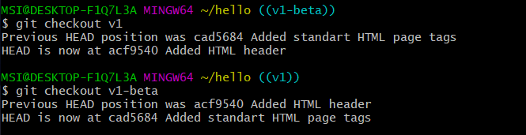

**1.4.7 Просмотр тегов с помощью команды tag**

Мы можем посмотреть наши теги. (рис. 027)

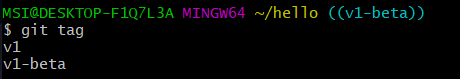

Мы можем видеть теги в логе вместе с именем ветки. (рис. 028)

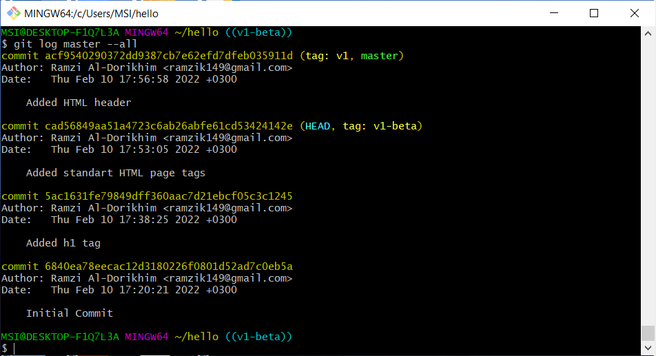

## 1.5 Отмена локальных изменений (до индексации)

**1.5.1 Переключимся на ветку master**

Убедимся, что мы находимся на последнем коммите ветки master при помощи команды git checkout master.

**1.5.2 Изменим hello.html**

Внесем нежелательные изменения в файл hello.html. Делать я буду это при помощи Vim. (рис. 029)

**1.5.3 Проверим состояние**

Проверим состояние рабочего каталога при помощи команды git status. Мы видим, что файл hello.html был изменен, но еще не проиндексирован. (рис. 030)

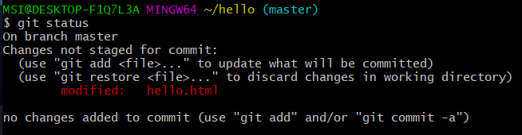

**1.5.4 Отменим изменения в рабочем каталоге**

Используем команду git checkout для переключения версии файла hello.html в репозитории.

(рис. 031)

Как мы видим, не было произведено никаких изменений, незафиксированных в рабочем каталоге.

## 1.6 Отмена проиндексированных изменений(перед коммитом)

**1.6.1 Изменим файл и проиндексируем изменения**

Внесем изменения в файл hello.html в виде нежелательного комментария. (рис. 032)

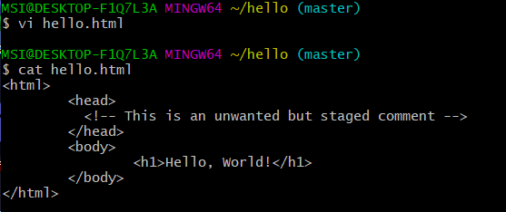

**1.6.2 Проверим состояние**.

Проиндексируем это изменение и проверим состояние. (рис. 033)

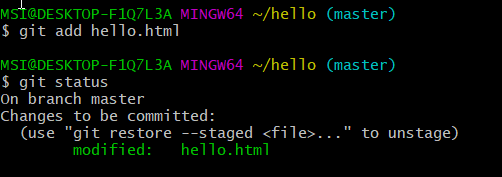

**1.6.3 Выполним сброс буферной зоны**

Вывод состояния показывает нам именно то, что мы должны сделать для отмены индексации изменения: git reset HEAD hello.html. (рис. 034)

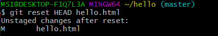

Команда git reset сбрасывает буферную зону к HEAD. Это очищает буферную зону от изменений, которые мы только что проиндексировали.

**1.6.4 Переключимся на версию коммита**

Что бы рабочий каталог был чистым, выполним следующие команды:

git checkout hello.html 

git status (рис. 035)

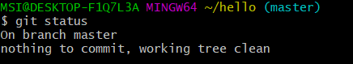

Наш рабочий каталог опять чист.

## 1.7 Отмена коммитов

**1.7.1 Отмена коммитов**

Иногда мы понимаем, что новые коммиты являются неверными. Мы отменим коммит путем создания нового коммита, отменяющего нежелательные измененя.

**1.7.2 Изменим файл и сделаем коммит**

Изменим файл hello.html на следующий. (рис. 036)

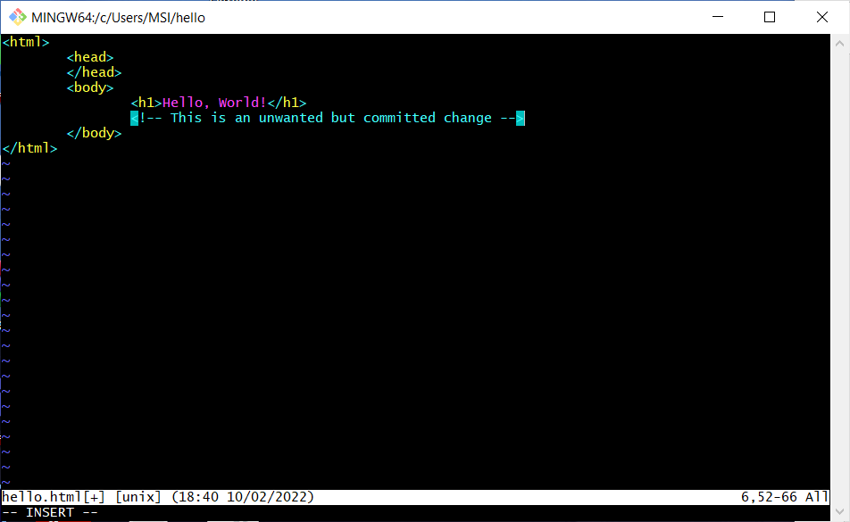

Выполним следующие команды. (рис. 037)

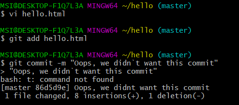

**1.7.3 Сделайте коммит с новыми изменениями, отменяющими предыдущие**

Что бы отменить коммит, нам необходимо сделать коммит, который удаляет изменения, сохраненные нежелательным коммитом. (рис. 038) (рис. 039)

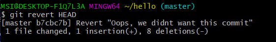

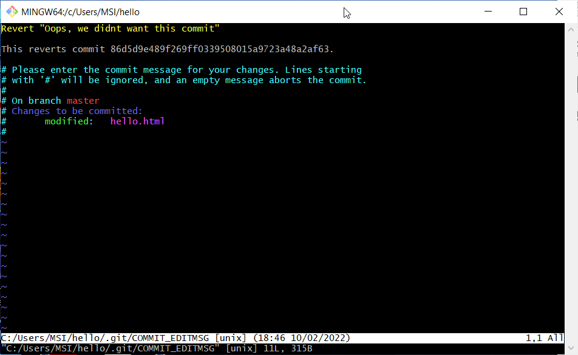

**1.7.4 Проверим лог**

Проверка лога показывает нежелательные и отмененные коммиты в наш репозиторий. (рис. 040)

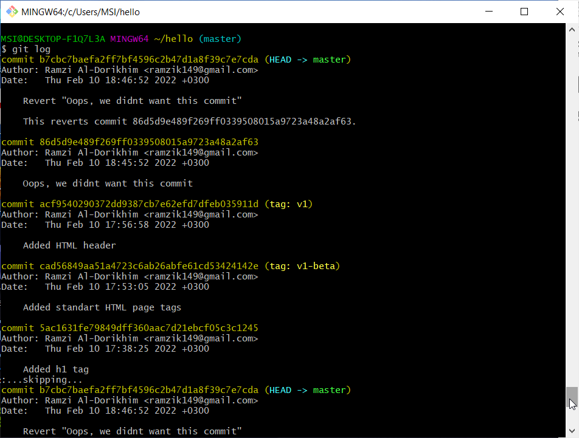

## 1.8 Удаление коммитов из ветки

git revert - это конечно хорошо. Но что если нам будет нужно, что бы отмененные коммитов никогда и не было. На помощь придет git reset. Данная команда даже предотвратит появление нежелательного коммита в истории git log.

**1.8.1 Команда git reset**

При получении ссылки на коммит (т.е. хэш, ветка или имя тега), команда git reset: 

перепишет текущую ветку, чтобы она указывала на нужный коммит; 

опционально сбросит буферную зону для соответствия с указанным коммитом; 

опционально сбросит рабочий каталог для соответствия с указанным коммитом.

**1.8.2 Проверим нашу историю**

Сделаем проверку нашей истории коммитов. (рис. 041)

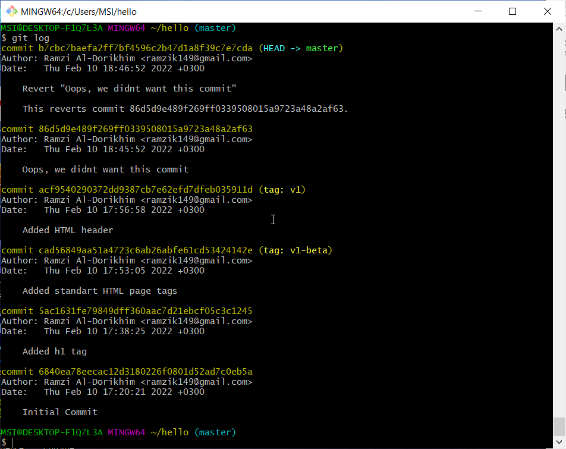

Видим, что два последних коммита в этой ветке - "Oops" и "Revert Oops".

Удалим их при помощи сброса.

**1.8.3 Для начала отметим эту ветку**

Прежде чем удалять коммиты, давайте отметим последний коммит тегом, чтобы потом можно было его найти. (рис. 042)

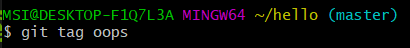

**1.8.4 Сброс коммитов к предшествующим коммиту Oops**

Глядя на историю лога, мы видим, что коммит с тегом «v1» является коммитом, предшествующим ошибочному коммиту. Давайте сбросим ветку до этой точки. (рис. 043)

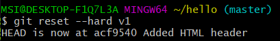

Взглянем на log. (рис. 044)

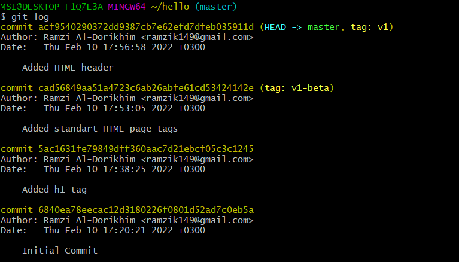

Наша ветка master теперь указывает на коммит v1, а коммитов Oops и Revert Oops в ветке уже нет. Параметр --hard указывает, что рабочий каталог должен быть обновлен в соответствии с новым head ветки.

**1.8.5 Ничего никогда не теряется**

Что же тогда случается с ошибочными коммитами? На самом деле, коммиты все еще находятся в репозитории. Мы даже можем на них ссылаться. Что бы посмотреть на все коммиты , нужно применить команду git log --all. (рис. 045)

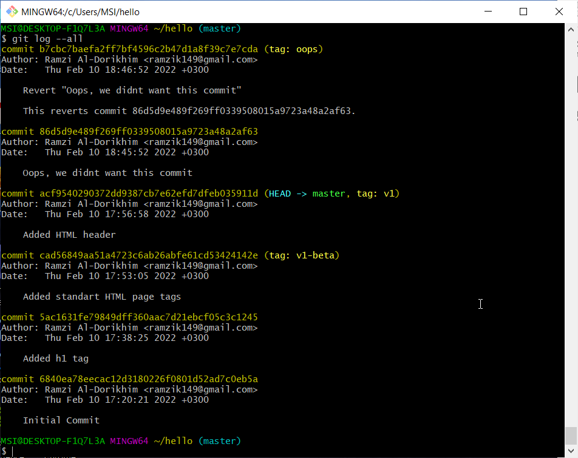

Мы видим, что ошибочные коммиты не исчезли, они просто отсуствуют в ветке master. 

Помните,  мы отметили ошибочные коммиты тегами ? Это сделано для того, что бы была возможность на них ссылаться, не используя их хеш-коды. Коммиты, на которые нет ссылок, остаются в репозитории до тех пор, пока не будет запущен сборщик мусора.

**1.8.6 Опасность сброса**

Сброс в локальных ветках, как правило, безопасен. Последствия любой «аварии» как правило, можно восстановить простым сбросом с помощью нужного коммита. Однако, если ветка «расшарена» на удаленных репозиториях, сброс может сбить с толку других пользователей ветки.

## 1.9 Удаление тега oops

**1.9.1 Удаление тега oops**

Тег "oops" выполнил свою функцию. Удалим его и коммиты, на которые он ссылается при помощи сборщика мусора. (рис. 046)

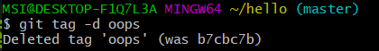

Посмотрим на log. (рис. 047)

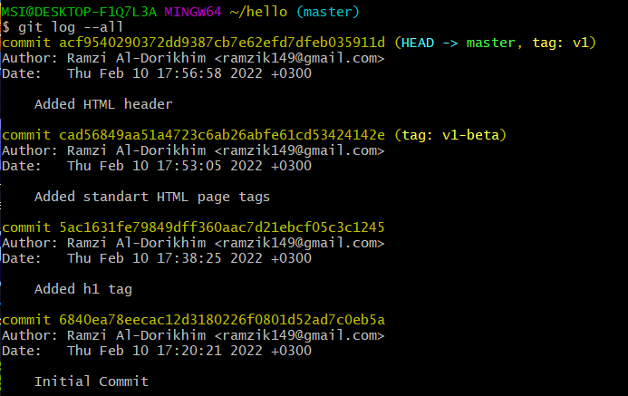

Тег "oops" больше не будет отображаться в репозитории.

##  1.10 Внесение изменений в коммиты

**1.10.1 Измените страницу, а затем сделайте коммит**

Добавим в файл hello.html свои ФИО. (рис. 048)

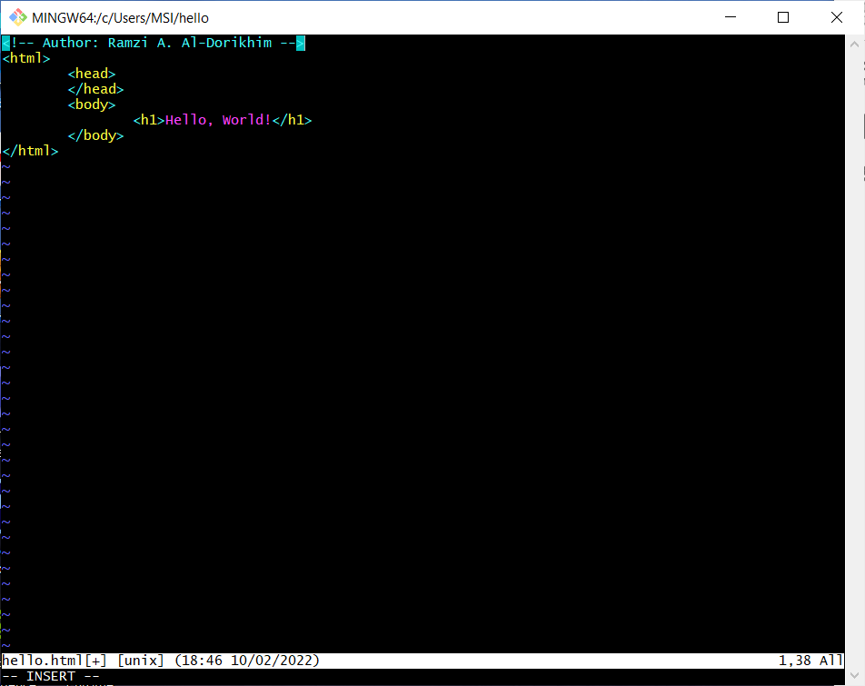

Выполним. (рис. 049)

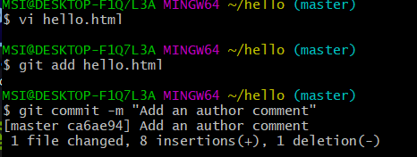

**1.10.2 Необходим email**

После совершения коммита мы понимаем, что любой хороший комментарий должен включать электронную почту автора. Обновим страницу hello, включив в нее email. (рис. 050)

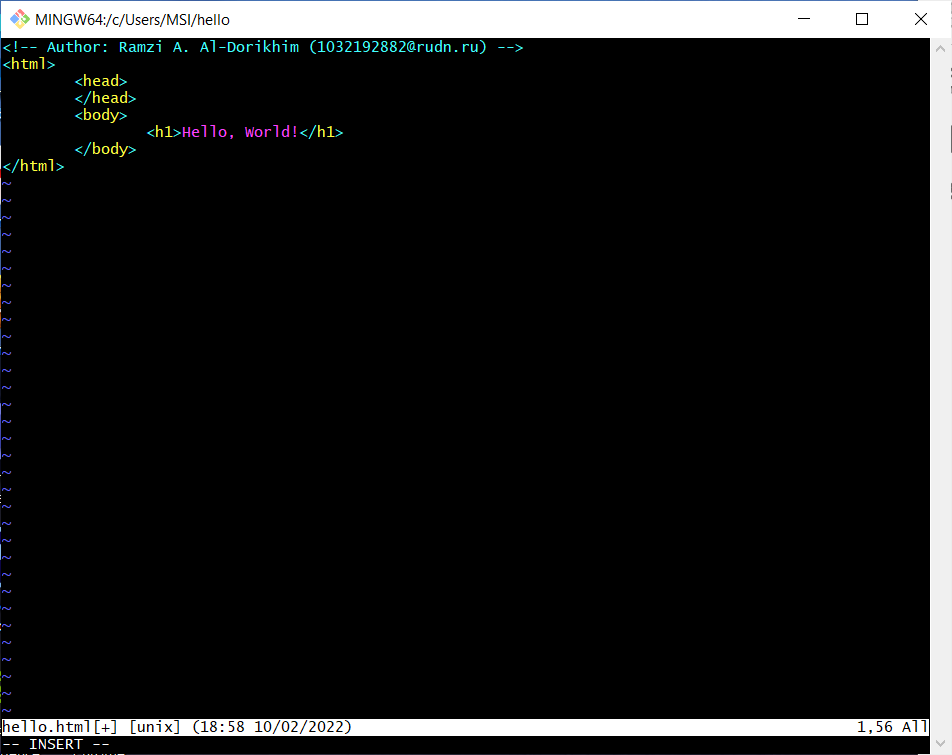

**1.10.3 Изменим предыдущий коммит**

Мы действительно не хотим создавать отдельный коммит только ради электронной почты. Давайте изменим предыдущий коммит, включив в него адрес электронной почты.

Выполним следующее. (рис. 051)

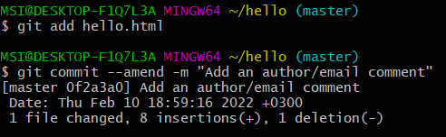

**1.10.4 Просмотр истории**

Мы можем увидеть, что оригинальный коммит «автор» заменен коммитом «автор/email». Этого же эффекта можно достичь путем сброса последнего коммита в ветке, и повторного коммита новых изменений. (рис. 052)

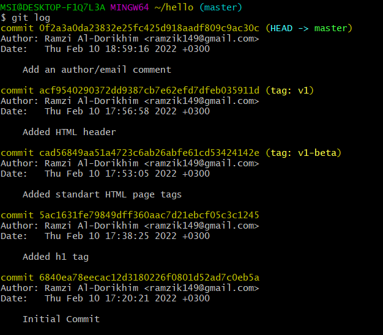

## 1.11 Перемещение файлов

**1.11.1 Переместите файл hello.html в каталог lib**

Давайте перенесем страницу в каталог lib. (рис. 053)

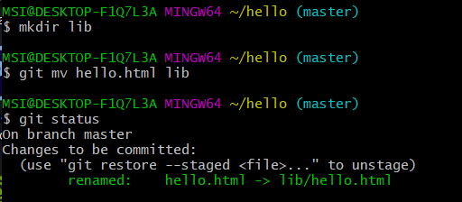

Перемещая файлы с помощью git mv, мы информируем git о 2 вещах: 

 Что файл hello.html был удален. 

Что файл lib/hello.html был создан. 

Оба эти факта сразу же проиндексированы и готовы к коммиту. Команда git status сообщает, что файл был перемещен.

**1.12 Второй способ перемещения файлов**

 Следующий набор команд идентичен нашим последним действиям. Работы здесь побольше, но результат тот же. 

Мы могли бы выполнить: 

mkdir lib 

mv hello.html lib 

git add lib/hello.html 

git rm hello.html

**1.12.1 Коммит в новый каталог**

Сделаем коммит перемещения. (рис. 054)

## 1.13 Подробнее о структуре

**1.13.1 Добавление index.html**

Добавим файл index.html в наш репозиторий.(рис. 055)

Добавим файл и сделаем коммит. (рис. 056)

Теперь при открытии index.html, мы видим кусок страницы hello в маленьком окошке. (рис. 057)

## 1.14 Git внутри: Каталог .git

**1.14.1 Каталог .git**

Выполним следующую команду. (рис. 058)

Это каталог, в котором хранится вся информация git.

**1.14.2 База данных объектов**

Выполним следующую команду. (рис. 059)

Мы видим набор каталогов, имена которых состоят из 2 символов. Имена каталогов являются первыми двумя буквами хэша sha1 объекта, хранящегося в git.

**1.14.3 Углубляемся в базу данных объектов**

Выполним следующую команду. (рис. 060)

Мы посмотрели в каталог bf. Мы видим файла с именами из 38 символов. Это файлы, содержащие объекты, хранящиеся в git. Они сжаты и закодированы.

**1.14.4 Config File**

Выполним следующую команду. (рис. 061)

Это файл конфигурации, создающийся для каждого конкретного проекта. Записи в этом файле будут перезаписывать записи в файле .gitconfig нашего главного каталога, по крайней мере в рамках этого проекта.

**1.14.5 Ветки и теги**

Выполним следующие команды. (рис. 062)

Каждый файл соответствует тегу, ранее созданному с помощью команды git tag. Его содержание — это всего лишь хэш коммита, привязанный к тегу.

**1.14.6 Файл HEAD**

Выполним следующую команду. (рис. 063)

Файл HEAD содержит ссылку на текущую ветку.

## 1.15 Работа непосредственно с объектами git

**1.15.1 Поиск последнего коммита**

Выполним следующую команду. (рис. 064)

Эта команда должна показать последний коммит в репозиторий.

**1.15.2 Вывод последнего коммита с помощью SHA1 хэша**

Выполним следующие команды. (рис. 065)

**1.15.3 Поиск дерева**

Выполним следующую команду. (рис. 066)

Мы можем вывести дерево каталогов, ссылка на который идет в коммите.

**1.15.4 Вывод каталога lib**

Выполним следующую команду. (рис. 067)

**1.15.5 Вывод файла hello.html**

Выполним следующую команду. (рис. 068)

**1.15.6 Исследуем самостоятельно**

Исследуем git репозиторий вручную самостоятельно. Посмотрим, удастся ли нам найти оригинальный файл hello.html с самого первого коммита вручную по ссылкам SHA1 хэша в последнем коммите.

Давайте взглянем на рис. 069 и рис. 070. Я попробовал дойти с последнего коммита до самого первого по ссылкам SHA.

Как мы видим внизу на рис. 070 , мне удалось дойти до самого первого коммита.

## 1.16 Создание ветки

Что бы сделать hello world более выразительным, мы создадим отдельную ветку, чтобы изолировать эти изменения от изменений в ветке master.

**1.16.1 Создайте ветку**

Давайте назовем нашу новую ветку «style».

Выполним следующую команду. (рис. 071)

**1.16.2 Добавим файл стилей style.css**

Выполним следующие команды. (рис. 072)

Выполним следующие команды. (рис. 073)

**1.16.3 Изменим основную страницу**

Обновим файл hello.html, чтобы использовать стили style.css.(рис. 074)

Выполним следующие команды. (рис. 075)

**1.16.4 Изменим index.html**

Обновим файл index.html, чтобы он тоже использовал style.css  (рис. 076)

Выполним следующие команды. (рис. 077)

Результат. (рис. 078)

## 1.17 Навигация по веткам

Теперь в нашем проекте есть две ветки. Выполним следующую команду. (рис. 079)

**1.17.1 Переключение на ветку master**

Выполним следующие команды. (рис. 080)

Используя команду git checkout для переключения между ветками , мы переключил на ветку master.

**1.17.2 Вернемся к ветке style**

Выполним следующие команды. (рис. 081)

Содержимое lib/hello.html подтверждает, что мы вернулись на ветку style.

## 1.18 Изменения в ветке master

**1.18.1 Создайте файл README в ветке master**

Выполним следующие команды. (рис. 082)

Мы создали файл README.md

## 1.19 Сделайте коммит изменений README.md в ветку master.

Выполним следующие команды. (рис. 083)

**1.19.1 Просмотр отличающихся веток**

Теперь у нас в репозитории есть две отличающиеся ветки. Используем следующую лог-команду для просмотра веток и их отличий.

Выполним следующую команду. (рис. 084)

Добавление опции --graph в git log вызывает построение дерева коммитов с помощью простых ASCII символов.

## 1.20 Слияние

**1.20.1 Слияние веток**

Слияние переносит изменения из двух веток в одну. Давайте вернемся к ветке style и сольем master с style.

Выполним следующие команды. (рис. 085) (рис. 086)

Путем периодического слияния ветки master с веткой style вы можете переносить из master любые изменения и поддерживать совместимость изменений style с изменениями в основной ветке.

## 1.21 Создание конфликта

**1.21.1 Вернитесь в master и создайте конфликт**

Вернемся в ветку master и внесем следующие изменения. (рис. 087)

Выполним следующие команды. (рис. 088)

**1.21.2 Просмотр веток**

Выполним следующую команду. (рис. 089)

После коммита «Added README» ветка master была объединена с веткой style, но в настоящее время в master есть дополнительный коммит, который не был слит с style. Последнее изменение в master конфликтует с некоторыми изменениями в style. На следующем шаге мы решим этот конфликт.

## 1.22 Разрешение конфликтов

**1.22.1 Слияние master с веткой style**

Теперь вернемся к ветке style и попытаемся объединить ее с новой веткой master.

Выполним следующие команды. (рис. 090)

Откроем lib/hello.html. (рис. 091)

Первый раздел — версия текущей ветки (style). Второй раздел — версия ветки master.

**1.22.2 Решение конфликта**

Нам необходимо вручную разрешить конфликт. Внесем изменения в lib/hello.html для достижения следующего результата. (рис. 092)

**1.22.3 Сделаем коммит решения конфликта**

Выполним следующие команды. (рис. 093)

## 1.23 Сброс ветки style

**1.23.1 Сброс ветки style**

Вернемся на ветке style к точке перед тем, как мы слили ее с веткой master.Нам необходимо найти последний коммит перед слиянием.

Выполним следующие команды. (рис. 094)

Мы видим, что коммит «Updated index.html» был последним на ветке style перед слиянием. Давайте сбросим ветку style к этому коммиту.

Выполним следующую команду.  (рис. 095)

**1.23.2 Проверьте ветку**

Поищем лог ветки style. У нас в истории больше нет коммитов слияний. (рис. 096)

## 1.24 Сброс ветки master

**1.24.1 Сброс ветки master**

Добавив интерактивный режим в ветку master, мы внесли изменения, конфликтующие с изменениями в ветке style. Давайте вернемся в ветке master в точку перед внесением конфликтующих изменений. Это позволяет нам продемонстрировать работу команды git rebase, не беспокоясь о конфликтах.

Выполним следующие комадны. (рис. 097)

Коммит «Added README» идет непосредственно перед коммитом конфликтующего интерактивного режима. Мы сбросим ветку master к коммиту «Added README».

Выполним следующие команды. (рис. 098)(рис. 099)

Мы видим, что репозиторий был будто перемотан назад во времени.

## 1.25 Перебазирование

Используем команду rebase вместо команды merge. Мы вернулись в точку до первого слияния и хотим перенести изменения из ветки master в нашу ветку style. На этот раз для переноса изменений из ветки master мы будем использовать команду git rebase вместо слияния.

Выполним следующие команды. (рис. 100) (рис. 101) 

**1.25.1 Слияние VS перебазирование**

Конечный результат перебазирования очень похож на результат слияния. Ветка style в настоящее время содержит все свои изменения, а также все изменения ветки master. Однако, дерево коммитов значительно отличается. Дерево коммитов ветки style было переписано таким образом, что ветка master является частью истории коммитов. Это делает цепь коммитов линейной и гораздо более читабельной.

## 1.26 Слияние в ветку master

Мы поддерживали соответствие ветки style с веткой master (с помощью rebase), теперь давайте сольем изменения style в ветку master.

**1.26.1 Слияние style в master**

Выполним следующие команды. (рис. 102) 

Поскольку последний коммит ветки master прямо предшествует последнему коммиту ветки style, git может выполнить ускоренное слияние-перемотку. При быстрой перемотке вперед git просто передвигает указатель вперед, таким образом указывая на тот же коммит, что и ветка style. При быстрой перемотке конфликтов быть не может.

**1.26.2 Просмотрите логи**

Выполним следующую команду. (рис. 103) 

Теперь ветки style и master идентичны.

## 1.27 Клонирование репозиториев

**1.27.1 Перейдите в рабочий каталог**

Перейдем в рабочий каталог и сделаем клон вашего репозитория hello.

Выполним следующие команды. (рис. 104) 

**1.27.2 Создадим клон репозитория hello**

Выполним следующие команды:

git clone hello cloned_hello 

ls

 (рис. 105)  

Мы видим в рабочем каталоге теперь  два репозитория: оригинальный репозиторий «hello» и клонированный репозиторий «cloned_hello»

## 1.28 Просмотр клонированного репозитория

**1.28.1 Давайте взглянем на клонированный репозиторий.**

Выполним следующие команды. (рис. 106) 

Мы увидим список всех файлов на верхнем уровне оригинального репозитория README.md, index.html и lib.

**1.28.2 Просмотрите историю репозитория**

Выполним следующую команду. (рис. 107)

Мы увидели список всех коммитов в новый репозиторий, и он должен (более или менее) совпадать с историей коммитов в оригинальном репозитории.  Также здесь мы увидим ветки со странными именами (origin/master, origin/style и origin/HEAD).

## 1.29 Что такое origin?

Выполним следующие команды. (рис. 108)

Выполнив git remote, Мы видим, что клонированный репозиторий знает об имени по умолчанию удаленного репозитория. Давайте посмотрим, можем ли мы получить более подробную информацию об имени по умолчанию.

Выполнив git remote show origin, мы увидели что удаленные репозитории обычно размещаются на отдельной машине, возможно, централизованном сервере. Однако, как мы видим здесь, они могут с тем же успехом указывать на репозиторий на той же машине. Нет ничего особенного в имени «origin», однако существует традиция использовать «origin» в качестве имени первичного централизованного репозитория (если таковой имеется).

## 1.30 Удаленные ветки

Давайте посмотрим на ветки, доступные в нашем клонированном репозитории.

Выполним следующую команду. (рис. 109)

Как мы видим, в списке только ветка master. Команда git branch выводит только список локальных веток по умолчанию.

**1.30.1 Список удаленных веток**

Для того, чтобы увидеть все ветки, попробуем следующую команду.(рис.110)

Git выводит все коммиты в оригинальный репозиторий, но ветки в удаленном репозитории не рассматриваются как локальные.

## 1.31 Изменение оригинального репозитория

Внесем некоторые изменения в оригинальный репозиторий, чтобы затем попытаться извлечь и слить изменения из удаленной ветки в текущую.

**1.31.1 Внесите изменения в оригинальный репозиторий hello**

Выполним следующую команду и отредактируем файл README.md. (рис. 111)

Теперь добавим это изменение и сделаем коммит. (рис. 112)

Слово World я заменил на world.

Теперь в оригинальном репозитории есть более поздние изменения, которых нет в клонированной версии. Далее мы извлечем и сольем эти изменения в клонированный репозиторий.

**1.31.2 Извлечение изменений**

Научиться извлекать изменения из удаленного репозитория.

Выполним следующие команды. (рис. 113)  (рис. 114)

Сейчас мы находимся в репозитории cloned_hello. На данный момент в репозитории есть все коммиты из оригинального репозитория, но они не интегрированы в локальные ветки клонированного репозитория.

**1.31.3 Проверим README.md**

Мы можем продемонстрировать, что клонированный файл README.md не изменился. (рис. 115)

## 1.32 Слияние извлеченных изменений

**1.32.1 Слейте извлеченные изменения в локальную ветку master**

Выполним.(рис. 116)

**1.32.2 Еще раз проверьте файл README.md**

Сейчас мы должны увидеть изменения.

Выполним.(рис. 117)

Отличие между 115 и 117 рисунками в слове World. Cначала с большой буквы, а потом с маленькой.

Теперь давайте рассмотрим объединение fetch и merge в одну команду. (рис. 118)

Выполнение git pull эквивалентно двум следующим шагам:

git fetch 

git merge origin/master

## 1.33 Добавление ветки наблюдения

Ветки, которые начинаются с remotes/origin являются ветками оригинального репозитория. Обратим внимание, что у вас больше нет ветки под названием style, но система контроля версий знает, что в оригинальном репозитории ветка style была.

**1.33.1 Добавим локальную ветку, которая отслеживает удаленную ветку**

Выполним. (рис. 119)

Теперь мы можем видеть ветку style в списке веток и логе.

## 1.34 Чистые репозитории

Чистые репозитории (без рабочих каталогов) обычно используются для расшаривания. Обычный git-репозиторий подразумевает, что вы будете использовать его как рабочую директорию, поэтому вместе с файлами проекта в актуальной версии, git хранит все служебные, «чисто-репозиториевские» файлы в поддиректории .git. В удаленных репозиториях нет смысла хранить рабочие файлы на диске (как это делается в рабочих копиях), а все что им действительно нужно — это дельты изменений и другие бинарные данные репозитория. Вот это и есть «чистый репозиторий».

## 1.35 Создаем чистый репозиторий

Выполним. (рис. 120)

Сейчас мы находимся в рабочем каталоге Как правило, репозитории, оканчивающиеся на .git являются чистыми репозиториями. Мы видим, что в репозитории hello.git нет рабочего каталога. По сути, это есть не что иное, как каталог .git нечистого репозитория.

## 1.36 Добавление удаленного репозитория

Давайте добавим репозиторий hello.git к нашему оригинальному репозиторию.(рис. 121)

## 1.37 Отправка изменений

Так как чистые репозитории, как правило, расшариваются на каком-нибудь сетевом сервере, нам необходимо отправить наши изменения в другие репозитории. Начнем с создания изменения для отправки.  Отредактируем файл README.md и сделаем коммит.(рис. 122)

Теперь отправим изменения в общий репозиторий.(рис. 123)

## 1.38 Извлечение общих изменений

Научимся извлекать изменения из общего репозитория. (рис. 124)

# Вывод

Благодаря этой лабораторной работе я наконец-то пришел к Git Bash. Научился им пользоваться, что несомненно является очень полезным навыком.

# Список литературы

Кулябов Д. С.  *Лабораторная работа №1**: git.pdf*

Кулябов Д. С.  *Лабораторная работа №1**: markdown.pdf* 

