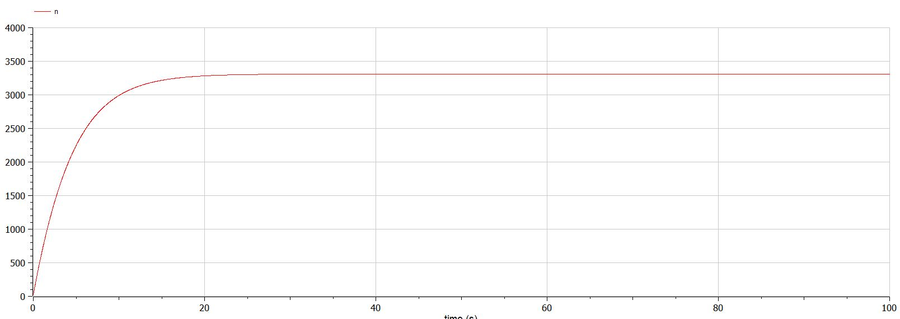
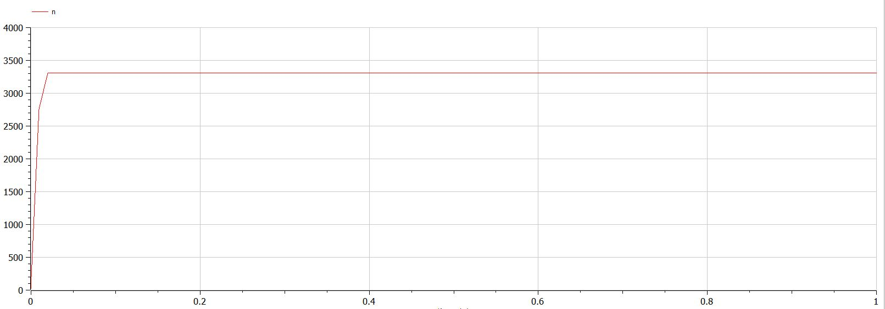
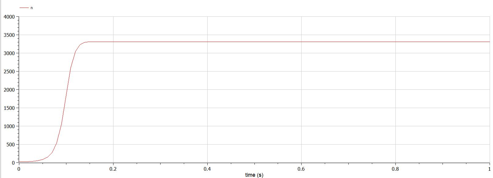
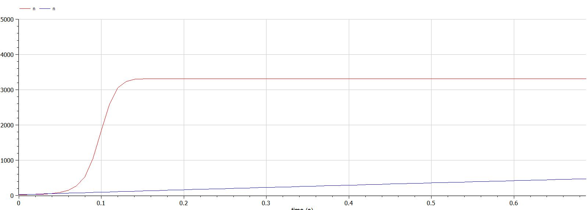

# Лабораторная работа №7
## Ramzi A. Al-Dorikhim
### RUDN University, 2022 Moscow, Russia

---
<!--_class: titleslide1 -->
#### Прагматика выполнения лабораторной работы

* Рекламодатели, рекламные агентства и каналы распространения рекламы давно и активно интересуются механизмами воздействия рекламы на потребителей;

* Это необходимо для того, чтобы:

    * сформулировать более эффективные рекламные стратегии;
    * показать результаты отдачи от рекламы;
    * доказать соответствие выбора рекламных площадок для размещения.

---
<!--_class: titleslide2 -->
#### Цель выполнения лабораторной работы
Рассмотреть модель распространения рекламы.

---
<!--_class: titleslide2 -->
#### Задача выполнения лабораторной работы

* Рассмотреть модель рапространения рекламы в разных случаях.

* Сравнить решения, учитывающее вклад только платной рекламы и учитывающее вклад только сарафанного радио.

---
<!--_class: titleslide2 -->
#### Уравнения

$\frac{\partial n}{\partial t} = (0.211 + 0.000011n(t))(N - n(t))$
$\frac{\partial n}{\partial t} = (0.0000311 + 0.2n(t))(N - n(t))$
$\frac{\partial n}{\partial t} = (0.511sin(t) + 0.311sin(t)n(t))(N - n(t))$

---
<!--_class: titleslide4 -->
#### Случай 1:  a1>a2

#  

---
<!--_class: titleslide4 -->
#### Случай 2: a1<a2

#  
---
<!--_class: titleslide4 -->
#### Случай 3:  a1≈a2

#  

---
<!--_class: titleslide4 -->
#### Сравнение  эффективности сарафанного радио и платной рекламы

#  
---

<!--_class: titleslide2 -->
#### Вывод
1. Рассмотрел модель эффективности рекламы в разных случаях.
2. Сравнил решения, учитывающее вклад только платной рекламы и учитывающее вклад только сарафанного радио.

---
# Спасибо за внимание
