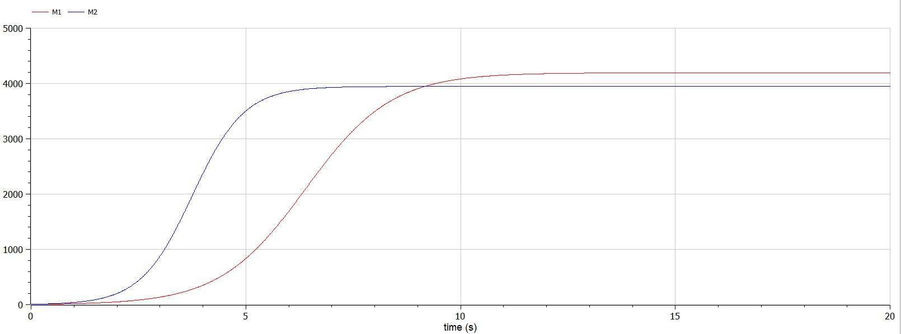
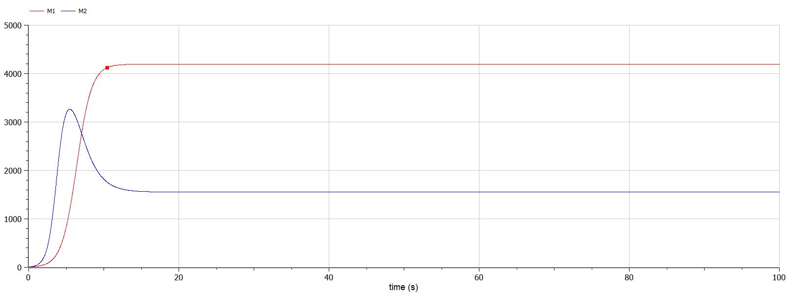

# Лабораторная работа №8
## Ramzi A. Al-Dorikhim
### RUDN University, 2022 Moscow, Russia

---
<!--_class: titleslide1 -->
#### Прагматика выполнения лабораторной работы

* Пердприятия и фирмы должны знать механизмы работы конкуренции;
* Это необходимо для того, чтобы:
    * предсказать доходность или убыточность;
    * проанализировать, как то или иное решение повлияет на ситуацию;
    * доказать необходимость принимаемых решений.
---
<!--_class: titleslide2 -->
#### Цель выполнения лабораторной работы
Рассмотреть модель конкуренции двух фирм.

---
<!--_class: titleslide2 -->
#### Задача выполнения лабораторной работы

* Рассмотреть модель конкуренции фирм в разных случаях.

* Построить графики изменения оборотных средств и проанализировать их.

---
<!--_class: titleslide2 -->
#### Уравнения

$$
				 \begin{cases} \frac{\partial M_1}{\partial \theta} = M_1 -  \frac{b}{c_1} M_1 M_2 - \frac{a_1}{c_1} M_1^2  \\ \frac{\partial M_2}{\partial \theta} = \frac{c_2}{c_1} M_2 -\frac{b}{c_1} M_1 M_2 - \frac{a_2}{c_1} M_2^2 \end{cases}
				$$

---

$$
					
				
				
				 \begin{cases} \frac{\partial M_1}{\partial \theta} = M_1 -  \frac{b}{c_1} M_1 M_2 - \frac{a_1}{c_1} M_1^2  \\ \frac{\partial M_2}{\partial \theta} = \frac{c_2}{c_1} M_2 -(\frac{b}{c_1} + 0.00024) M_1 M_2 - \frac{a_2}{c_1} M_2^2 \end{cases}
				$$

---
<!--_class: titleslide4 -->
#### Случай 1

#  

---
<!--_class: titleslide4 -->
#### Случай 2

#  

---

<!--_class: titleslide2 -->
#### Вывод
Рассмотрел модель конкуренции двух фирм в разных случаях и проанализировал отличия.

---
# Спасибо за внимание
