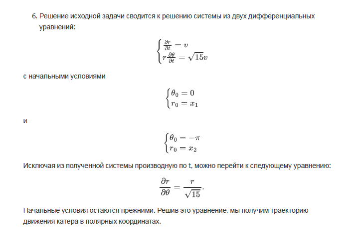
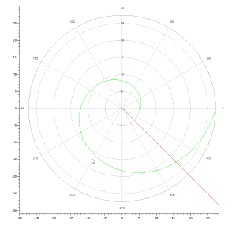
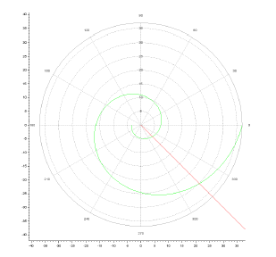

# Лабораторная работа №2
## Ramzi A. Al-Dorikhim
### RUDN University, 2022 Moscow, Russia

---
<!--_class: titleslide1 -->
#### Прагматика выполнения лабораторной работы
* Ознакомление и изучение с основами математического моделирования.
* Получение навыков визуализации траектории движения.

---
<!--_class: titleslide2 -->
#### Цель выполнения лабораторной работы
* Научиться решать задачи о погоне.
* Визуализация траекторий движения.
* Научиться выводить уравнения движения.

---
<!--_class: titleslide3 -->
#### Задача выполнения лабораторной работы

* Вывести уравнение, которое описывает движение катера, с начальными условиями, которые описывают два случая.

* Построить трактории движения в двух случая.

* Найти точки пересечения траекторий в двух случаях.

---
<!--_class: titleslide4 -->
#### Уравнение

#  

---
<!--_class: titleslide5 -->
#### Результат

# 

# 

---
# Спасибо за внимание
